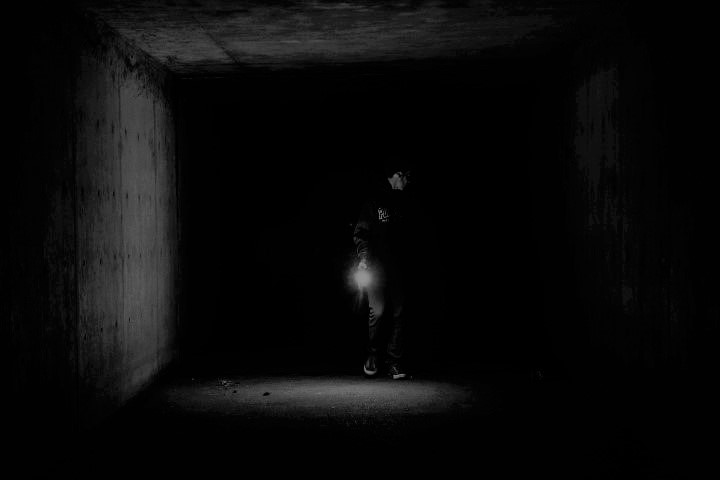{: style="width:100%"}

# anxY
anxY is a nerve wrecking Nightmare Jump & Run Game developed by mayfly studios with our own GameEngine using MonoGame as a helping tool. The Game was developed in the scope of a Bachelor Degree during one Semester.

# Table of Contents
- [Game Installation](#Installation)
    - [Supported Platforms](#Installation-SupportedPlatforms)
    - [Prerequisites](#Installation-Prerequisites)
    - [Download](#Installation-Download)
    - [Play](#Installation-Play)
    - [Stop](#Installation-Stop)
- [How To Build](#HowToBuild)
    - [Prerequisites](#HowToBuild-Prerequisites)
    - [Build](#HowToBuild-Build)
- [Make it your own Game](#DIY-Game)
    - [Map](#DIY-Game-Map)
- [About](#About)
    - [Idea](#About-Idea)
    - [Class Diagram](#About-ClassDiagram)
    - [Pattern](#About-Pattern)
    - [Tests](#About-Tests)
    - [Tools Used](#About-Tools-Used)
    - [Builds](#About-Builds)
- [Contributors](#Contributors)

---

# Game Installation

## Supported Platforms
For now, only Windows and MacOS are supported.

## Prerequisites

### .NET
If you don't have .NET installed, install it from [here](https://dotnet.microsoft.com/en-us/download/dotnet/6.0).

## Download
Download and unpack the latest zip for your operating system (Windows or Mac) from the [GitHub Releases Page](https://github.com/milattom/ANXY/releases).

## Play
On Windows simply start the exe file from the unpacked zip.

On Mac TODO.

### Mac Security Warning
TODO.

## Stop
There is no menu yet, so simply *ALT+F4* or press the *Window Closing Button*.

---

# How To Build

## Prerequisites

### Visual Studio (2022)
We recommend [Visual Studio](https://visualstudio.microsoft.com/) but you can try a different IDE. Be aware that if you use a differnt IDE, you might need to figure out on your own how to set everything up to be compatible with anxY.

### Git Client
Clone the repo or download the zip from GitHub and unpack it.
We recommend [Git Fork](https://git-fork.com/).

### dotnet
Should come with Visual Studio, if not download and install [.NET 6.0](https://dotnet.microsoft.com/en-us/download/dotnet/6.0).

### MonoGame
[Full MonoGame Installation Instructions](https://docs.monogame.net/articles/getting_started/1_setting_up_your_development_environment_windows.html).

### MonoGame Content Pipeline
In the terminal write `dotnet tool install -g dotnet-mgcb` and then `dotnet tool restore`. You can check it works with running `dotnet mgcb-editor`.

[Full Content Pipeline Installation Instructions](https://docs.monogame.net/articles/tools/mgcb_editor.html).

### MonoGame Extended Content Pipeline
In Visual Studio, in the Solution Explorer (*View/Solution Explorer*) right click on the Solution and choose *Manage NuGet Packages for Solution*.

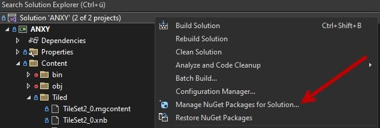

On the top right of the NuGet Package Manager click on the Settings (*gear icon*) and add the Package Source for MyGet.org `https://www.myget.org/F/lithiumtoast/api/v3/index.json`. Press *OK* to save the changes.

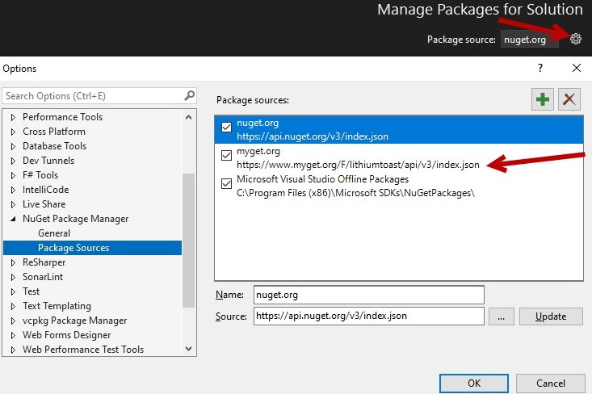

Again in the Package Manager, press *Browse* and search for `newtonsoft.json` and install the latest stabel version for our project (including Tests). Make sure that the Package source is *nuget.org*.

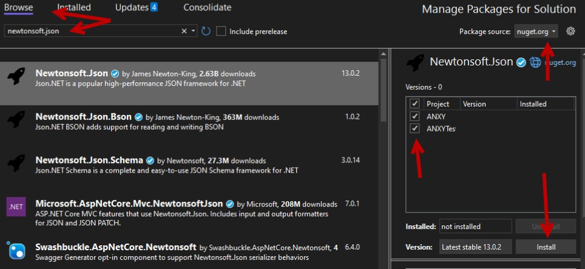

Now change the Package source to *MyGet.org* and check the *Include prerelease* Checkbox and search for the following Packages and install them whenever possible in the newest *alpha version*.

- `MonoGame.Content.Builder.Task`
- `MonoGame.Extended`
- `MonoGame.Extended.Contetn.Pipeline`
- `MonoGame.Extended.Tiled`
- `MonoGame.Framework.DesktopGL`

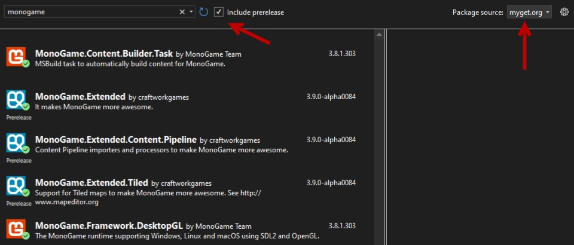

#### Change MonoGame Content Manager Settings
In the Solution Explorer right click the *Content.mgcb* in the folder *Content* and choose *open with*.

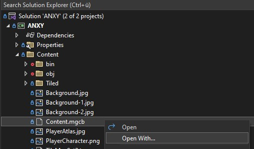

If you have can find the option to open it with *MGCB Editor*, perfect! Choose that and *Set as Default*, you can skip the next few steps and continue [here](#jumpToContent.mgcb). If you can't find the *MGCB Editor*, press *Add...*

\"")

The Installation Location of *MGCB-Editor* is `C:\Users\YOUR_USER_NAME\.nuget\packages\dotnet-mgcb-editor-windows\3.8.1.303\tools\net6.0\any\mgcb-editor-windows-data` replace YOUR_USER_NAME with your windows user name.

If you can't find the MGCB-Editor try running `dotnet tool install -g dotnet-mgcb` in the terminal and make sure it's installed. Then run `dotnet tool restore` and start *MGCB-Editor* with `dotnet mgcb-editor` and check in the Task Manager (CTLR+ALT+Delete) where the program is installed. Right click on the running Program, Properties.

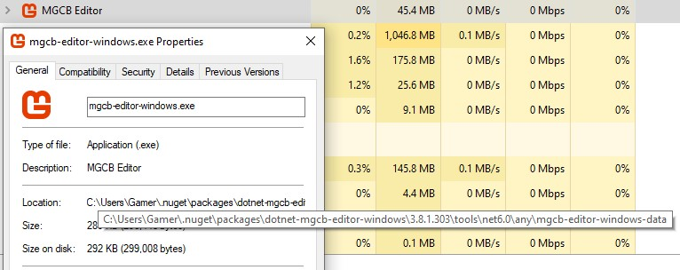

If you couldn't open it with the *MGCB Editor*, go [back](#Change-MonoGame-Content-Manager-Settings).

Open the Content.mgcb.
Click on the topmost red symbol with "content" written next to it. In the *Properties* Window-Section scroll to References and left click it. A new Window is opened.

In this new Window *Add* a new Location. The new alpha dll is installed under `C:\Users\YOUR_USER_NAME\.nuget\packages\monogame.extended.content.pipeline\3.9.0-alpha0084\tools\MonoGame.Extended.Content.Pipeline.dll`

After finding it and adding the new alpha version, remove the old one.

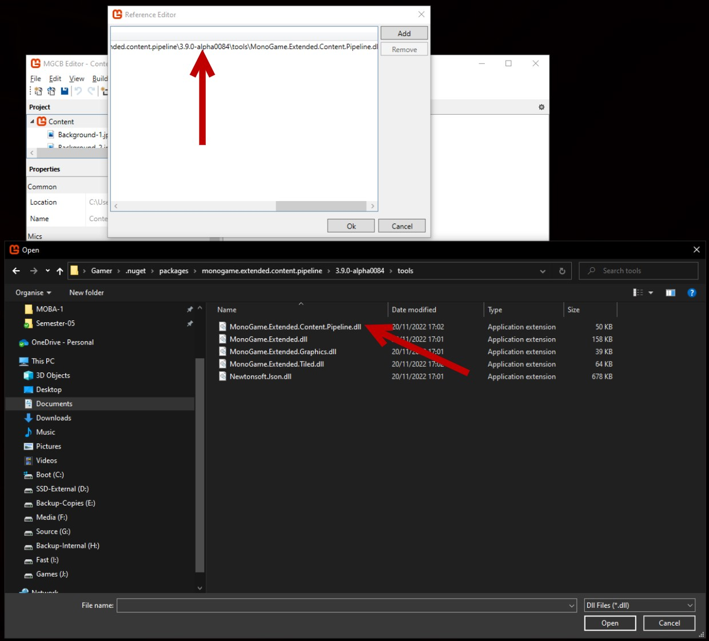

### GameBundle
In the Terminal:

Install dotnet Tool GameBundle `dotnet tool install --global GameBundle`

### Tiled
Only needed if you want to make your own Maps/Levels.

From [Tiled](https://www.mapeditor.org/) install the newest Version.

---

## Build 

1. ### Build Map
    Only needed if you want to make your own Maps/Levels.

    In Tiled, select the *.tmx* file and click `File/Save As` and save it as a `Tiled map files (*.tmx *.xml)` file in the *Game/Content* folder. You can find the *Game/Content* folder by right clicking it in the Solution Explorer and choosing `Open Folder in File Explorer`.

    Do the same for the *.tsx* file but save it as *tsx*.

    

1. ### Delete bin, obj and Tiled folder in Content
    Back in the Visual Studio Solution Explorer delete the folders `Content/bin`, `Content/obj` and `Content/Tiled`.

    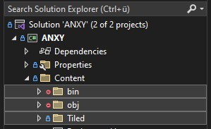

1. ### Build Content
    Open the Content.mgcb again and press `save`, `clean` and `build`. If you've added the *MGCB-Editor* as the default option before, you can simply double click the Content.mgcb file.

    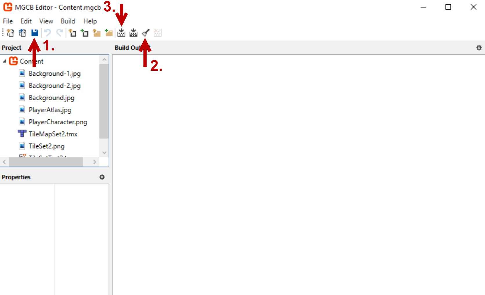

1. ### Check Tiled folder to Copy on Build
    After building there again should be those three folders we deleted before: *bin, obj and Tiled*. Open Tiled and select all files in this folder. `Right click` and choose `Properties`. In the now open Properties View, under *Copy to Output Directory* choose the option `Copy if newer`.

    

1. ### Delete Debug folder in bin
    Don't worry, the hard part is now done.

    In the Solution Explorer right click the solution and choose `Open Folder in File Explorer`. Go to *ANXY/bin* and delete any `Debug` folders that are in there.

    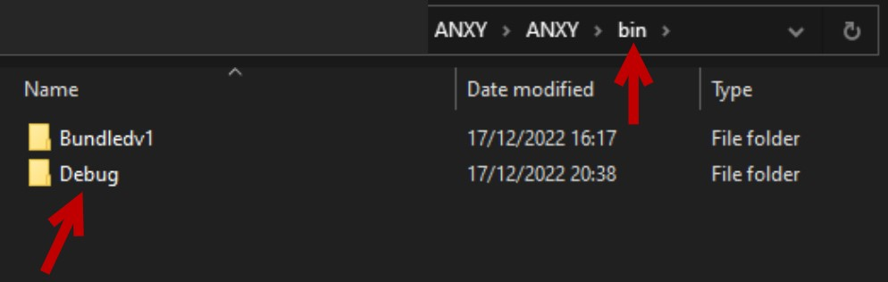

1. ### Build with Visual Studio    
    In the Solution Explorer, Right Click the topmost thing called `Solution 'ANXY'` and choose `Build    Solution`.

1. ### Build with GameBundle
    In the Terminal:
    
    Change to the ANXY solution directory and go into the ANXY  Application. `cd .\ANXY\`

    The command `ls` should show you something like this:
    
    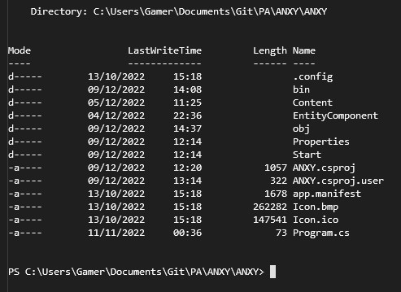
    
    With `gamebundle --help` you can show any possible commands.
    
    To build a *windows app* write `gamebundle -w -v`
    
    And to build the *macOS app* write `gamebundle -m --mac-bundle     -v`
    
    If the console output shows something along the lines of *dotnet is missing or not installed* go to the provided  link in the Terminal-Output or follow this link [dotnet install link](https://dotnet.microsoft.com/en-us/download/dotnet/thank-you/runtime-2.1.30-windows-x64-installer?cid=getdotnetcore).
        
    The game output is located in `cd .\bin\Bundled\`. You've successfully build the app and it's ready for deployment!

---

# Make it your own Game

## Create your own Map

---

# About the game

## Idea

## Class Diagram
[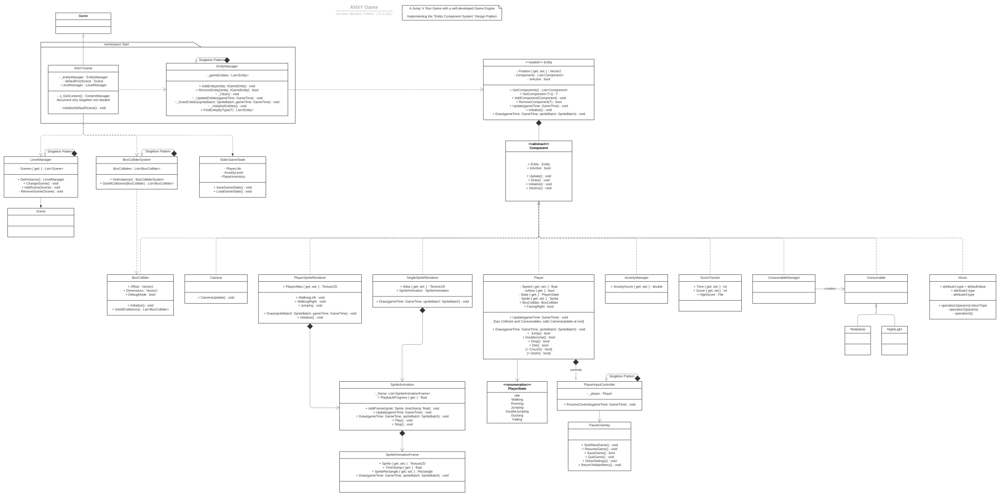{: style="width:100%"}](./Content/Images/ClassDiagram.svg)

## Pattern used

[Entity Component System](https://en.wikipedia.org/wiki/Entity_component_system) is a pattern mostly used in video game development for the representation of game world objects. An ECS comprises entities composed from components of data, with systems which operate on entities' components. ECS follows the principle of composition over inheritance, meaning that every entity is defined not by a type hierarchy, but by the components that are associated with it. Systems act globally over all entities which have the required components.

[Singleton pattern](https://en.wikipedia.org/wiki/Singleton_pattern) is a software design pattern that restricts the instantiation of a class to a singular instance. The pattern is useful when exactly one object is needed to coordinate actions across a system.

## Tests

## Tools Used

Many thanks for all these great tools which made it possible to develop anxY!

- [Visual Studio Community 2022](https://visualstudio.microsoft.com/vs/)
- [Git Fork](https://git-fork.com/)
- [GitHub](https://github.com/)
- [GitHub Actions](https://github.com/features/actions)
- [Jira](https://www.atlassian.com/software/jira)
- [LucidChart](https://www.lucidchart.com/pages/)
- [MonoGame](https://www.monogame.net/)
- [MonoGame Extended Content Pipeline](https://github.com/craftworkgames/MonoGame.Extended)
- [MonoGame Extended Content Pipeline Alpha](https://www.nuget.org/packages/MonoGame.Extended/3.9.0-alpha0084)
- [GameBundle](https://github.com/Ellpeck/GameBundle)

## Builds

-----

## Contributors

[{: style="width:65px"}](https://github.com/milattom)

[Milata Tomas Stefan (milattom)](mailto:milattom@students.zhaw.ch)

[{: style="width:65px"}](https://github.com/D-akeret)

[Akeret Dominic (akeredom)](mailto:akeredom@students.zhaw.ch)

